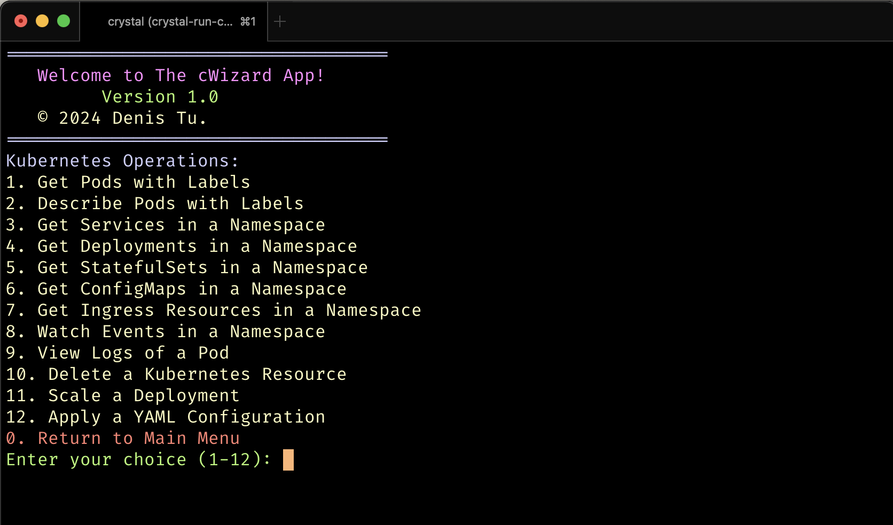

# cWizard CLI



## Overview

The `cWizard` CLI is a powerful command-line interface tool designed to simplify and enhance the management of `Docker` and `Kubernetes` (K8s) environments. It offers a range of functionalities to interact with `Docker containers`, `Kubernetes clusters`, and perform various operations without the need for direct `kubectl` or `docker` commands, making it ideal for server environments without a graphical interface.

## Why cWizard CLI?

While tools like `k9s` offer powerful `Kubernetes` management capabilities, `cWizard` CLI distinguishes itself in several key areas:

* `Simplicity and Ease of Use`: With an interactive, menu-driven interface, `cWizard` CLI simplifies complex K8s and Docker operations, making it accessible for users of all skill levels.
* `Customizability`: Tailored to adapt to various workflows, cWizard CLI can be easily customized to suit different operational needs.
* `Extensibility for Docker and K8s`: Unlike k9s, which focuses solely on `Kubernetes`, cWizard CLI provides comprehensive support for Docker operations as well.
* `Lightweight and Fast`: Designed to be lean and efficient, ensuring quick execution of commands and minimal resource usage.
* `Non-Graphical Environment Optimization`: Specifically optimized for server environments lacking a graphical interface, ensuring full functionality even in headless setups.

## Features

* `Docker` Operations
  * List Docker Images
  * List Docker Containers

* `Kubernetes` Operations
  * Get and describe pods with specific labels
  * Get services, deployments, stateful sets, config maps, and ingress resources in a specified namespace
  * View real-time events and logs of pods
  * Scale deployments and apply YAML configurations
  * Delete Kubernetes resources

## General

* Interactive menu-driven interface
* Color-coded terminal output for better readability
* Extensible architecture to add more functionalities

## Installation

### Prerequisites

Crystal programming language
Access to Docker and Kubernetes environments
Setup
Clone the repository and build the application:

```bash
git clone [repository-url]
cd [repository-directory]
crystal build cwizard.cr

# Usage
# Run the compiled binary:
./cwizard
Navigate through the interactive menu using the keyboard and follow the prompts to perform various operations.
```

Contributing
Contributions to the cWizard CLI are welcome. Please ensure to follow the contribution guidelines outlined in CONTRIBUTING.md.

License
This project is licensed under the MIT License.

Support
For support, feature requests, or bug reports, please open an issue in the repository.
